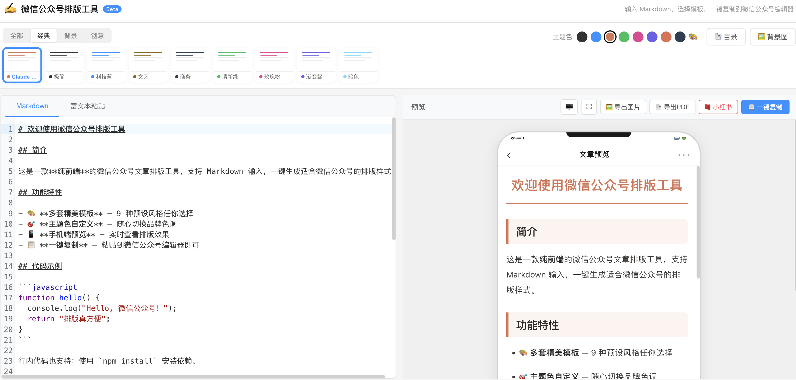

## 

## 先说结论

如果你经常写公众号，`wx-art-formatter` 值得试一次。  
它不是“又一个编辑器”，而是把你已经写好的内容，快速变成能在公众号后台稳定展示的版式。

项目地址：`https://github.com/bingo906/wx-art-formatter`

## 我为什么会关注它

很多时候，写作本身不难，难的是“发出去之前那 30 分钟”。

- 标题样式、段落间距、引用块要手动调
- 代码块一粘贴就变形
- 预览看着不错，粘到公众号后台又变样

`wx-art-formatter` 解决的是这个发布环节的低效问题：  
输入内容 -> 选择模板 -> 一键复制 -> 贴进公众号后台。

## 实际用了之后，我觉得有价值的点

### 1) 输入方式足够灵活

- 支持 Markdown 编辑
- 支持直接粘贴富文本

你可以继续用自己熟悉的写作方式，不需要为了工具改变流程。

### 2) 模板和主题色可快速切换

- 内置 17 套模板
- 支持主题色预设 + 自定义

对运营同学来说，这一点很关键：能快速做出“有账号风格”的文章，而不是每次从零调样式。

### 3) 预览和导出链路完整

- 实时预览
- 宽屏 / 全屏查看
- 一键复制 `text/html`
- 支持导出长图、导出 PDF

如果你既发公众号，也要发知识库或对外汇报材料，这套链路会很顺手。

## 它为什么能在公众号里保留样式

公众号编辑器会过滤很多样式写法，尤其是 `<style>` 和 class。  
这个项目的思路是把样式内联到每个元素上，用更“微信友好”的方式输出 HTML。

这也是它和普通网页编辑器最大的区别：  
目标不是网页渲染，而是“复制到公众号后台后依然稳定”。

## 我的建议用法

你可以先按这个最小流程跑一遍：

1. 写好 Markdown（或直接贴已有内容）
2. 选一个模板 + 调主题色
3. 点一键复制，粘贴到公众号后台
4. 最后只做少量微调再发布

## 适合什么人

- 个人号作者：想把排版时间压到最低
- 团队内容运营：需要更统一的视觉风格
- 技术写作者：经常要发带代码块的内容

## 最后

如果你正在维护公众号，建议先拿一篇旧文试试。  
对比一下“手工排版”与“工具排版”的耗时差，差异会非常直观。

如果你愿意，我下一篇可以继续写：  
“我最常用的 3 套模板 + 分别适合什么类型内容”。
